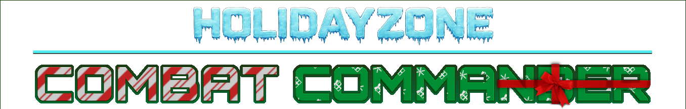
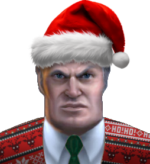
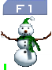
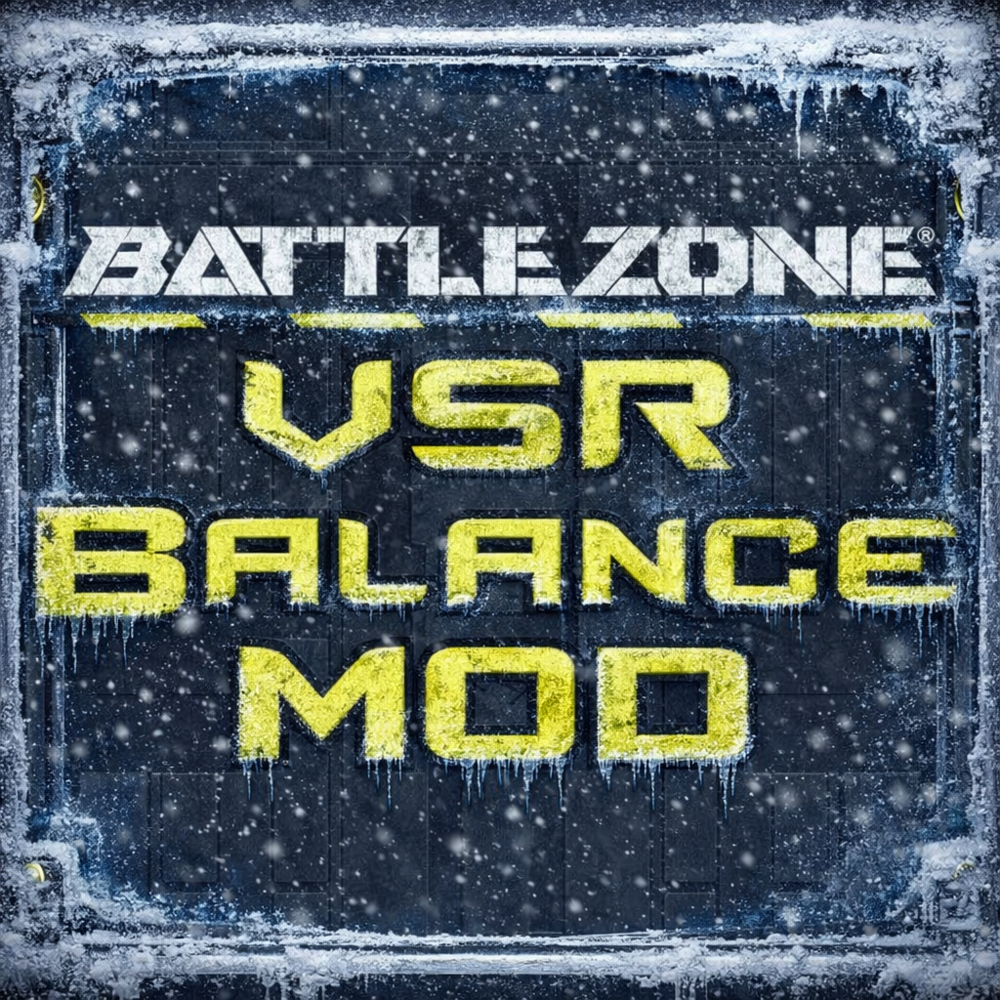

 

 

<!-- WORKSHOP -->

  
  </img>
  

> **Holidayzone** is designed to bring a new Christmas theme to Battlezone: Combat Commander!
Play on some of the most popular maps, all with a Christmas twist!
> ⚠️ NOTE: THIS MOD REQUIRES THE LATEST BZCC BETA-PATCH `2.0.203+`

### Other Helpful Resources 🔗

 

<!-- YOUTUBE -->
<h1 align="left">YouTube Spotlights </h1>
Watch some of these content creators' videos giving Holidayzone a spotlight!
  

    
    
    

    
    

# Credits 🎅

 

| Project Members | Contribution |
| --- | --- |
| `Cyber` | VSR Map Conversions, Music |
| `F9bomber` | Custom Mission Script |
| `Zorn` | Additional 3D Assets, Model Animations |
| `General Black Dragon` | Modding Support, VSR Dependency, Fireworks, Snowy Giza |

| Special Thanks To | For |
| --- | --- |
| `Nielk1` | Ported Hyper SFX |
| `Scrap Pool` | BioMetal Map Pack |
<!-- | `GrizzlyOne & Karlopitek` | Voyager II 3D Assets | -->

# Contents 🎄
- Christmas UI Overhaul 🎄
- Christmas ISDF Retexture 🧦
- Christmas Map Decorations ☃️
- Snowy Day & Night Environments 🌨️
- New IA/MPI/STCTF Defenders ⛄
- New Christmas Weapons 💣
- New STCTF Goals 🧊
- Snowball & Candy Scrap ❄️🍬
- Hot Cocoa Deposits/Pools ☕
- Festive Creatures 🦌
- Present Powerups 🎁

### Yule Units ⛄
> Variants indicated with `CPU` should be used for `IA/MPI/STCTF` maps.

 

 

| ODF | Name | Description | Use |
| --- | --- | --- | --- |
| `ibnutcracker` | Nutcracker | Tall Gun Tower w/ Plasma | RV |
| `ibnutcracker_cpu` | Nutcracker Statue | Tall Gun Tower w/ Blast | CPU |
| `ivnutcracker` | Nutcracker | Turret w/ Arc (Stealth) | - |
| `ivnutcracker_dm` | Nutcracker | Turret w/ Flash | DM |
| `ivnutcracker_toy` | Nutcracker Statue | Tall Turret w/ Blast | CPU |
| `ivcookie` | Tree Cookie | | A |
| `ivcookie2` | Tree Cookie II | | A |
| `iviceball` | Elf On Iceball | | A |
| `iviceblock` | Elf On Iceblock | | A |
| `ivrhino` | Yule Rhino | Ice Rhino w/ Frost | A |
| `ivsled` |  | Scav w/ Frost | A |
| `ivsled_dm` |  | Scav w/ Frost + Bump DMG | DM |
| `ivsleigh` | Sleigh (AA) | Flying Unit | A |
| `ivsleigh` | Sleigh (ATG) | Flying Unit | A |
| `ivsleigh_cpu` | Anti-Merry Sleigh | Flying Unit (Deployed) | CPU |
| `ivsnowball` | Mini Snowman | Assault Hover | A |
| `ivsnowball_m` | Empty Mini Snowman | - | RV |
| `ivsnowball2` | Mini Snowman II | Wears a hat! | A |
| `ivsnowman` | Naughty Snowman | Turret w/ Snowballs (Stealth) | CPU |
| `ivsnowman_turr` | Rattled Snowman | Turret w/ Miniguns | RV |
| `ivsnowman_dm` | Unfriendly Snowman | - | DM |

### Multiplayer Vehicle Lists 🎮
| Vehicle List | Title | Description |
| --- | --- | --- |
| `ElfVehicles` | Elf Piloted | Anything with a pilot on it |
| `JollyVehicles` | Jolly Vehicles | New & unique XMAS units |
| `SDFVehicles` | Santa's Defense Force Vehicles | Festive ISDF |
| `SledVehicles` | Sleds | Anything with sleds |
| `SnowballVehicles` | Snowball Throwers | Snowmen + Jingle Jackal |
| `XMASVehicles` | Holiday Vehicles | All XMAS units + festive ISDF |

## Maps 🏂
Here are some maps that have gotten a little christmas twist!

> Note: the following symbols denote included map variants where: 🌒 = Night / 🌨️ = Blizzard

| Map Name | Game Modes | Christmas Name | Source |
|-------------------|------------|-------------------------|--------|
| ✅ Candy Pass | DM | - | ❄️ |
| ✅ Snowball Fight | DM | - | ❄️ |
| ✅ Jinglin' Slopes | KOTH | - | ❄️ |
| ⌛ Snowpine 🌨️ | IA, MPI, ST, STCTF | - | ❄️ |
| ⌛ Winter Grove 🌨️ | IA, MPI, ST, STCTF | - | ❄️ |
| ⌛ Frosty Flats | FFA | - | ❄️ |
| ✅ Alien Dunes | IA, MPI, ST, STCTF | Arctic Drifts 🌒 | Stock 🔸 |
| ✅ Bridges | IA, MPI, ST, STCTF| Saint Nick's Crossing | Stock 🔸 |
| ✅ Canyons | IA, MPI, ST, STCTF| Jolly Chasm | Stock 🔸 |
| ✅ Chill | IA, MPI, ST, STCTF | Windchill | Stock 🔸 |
| ✅ Hi & Low |  IA, MPI, ST, STCTF | Ho Ho & Low 🌒 | Stock 🔸 |
| ✅ Iceberg | IA, MPI, ST, STCTF | Ice Cap | Stock 🔸 |
| ✅ Sea Battle | IA, MPI, ST, STCTF| Icy Blue Sea | Stock 🔸 |
| ✅ Quarry | IA, MPI, ST, STCTF | Winter Hollow | Stock 🔸 |
| ⌛ Rocks |  IA, MPI, ST, STCTF | Rockin' Around | Stock 🔸 |
| ⌛ Mars | IA, MPI, ST, STCTF | Candy-red Planet| Stock 🔸 |
| ⌛ High Heat | IA, MPI, ST, STCTF | High Freeze | Stock 🔸 |
| ✅ Ring of Fire | DM | Arctic Circle | Stock 🔸 |
| ✅ Bane | DM | Glacier | Stock 🔸 |
| ✅ Death Valley | CTF | Jingle Valley | Stock 🔸 |
| ✅ Rend | KOTH | Evergreen 🌒 | Stock 🔸 |
| ✅ Pluto | RACE | Polar Run | Stock 🔸 |
| ✅ Site 03 | IA, MPI, ST, STCTF | Polar Research Station 03 | Scrap Pool ➕ |
| ✅ Oasis | IA, MPI, ST, STCTF | Frozen Wonderland 🌒 | Scrap Pool ➕ |
| ✅ Europa Night | VSR ST/MPI | Europa Night | VSR 🔹 |
| ✅ Giza | VSR ST/MPI | Snowy Giza | VSR 🔹 |
| ✅ Consciousness | VSR ST/MPI | Europa Night | VSR 🔹 |
| ✅ Overlook | VSR ST/MPI | Overfrost | VSR 🔹 |
| 🛠️ Jungle | VSR ST/MPI | Jungle | VSR 🔹 |
| ✅ Remnant | VSR ST/MPI | Remnant of Winter | VSR 🔹 |
| ✅ Haven | VSR ST/MPI | Snowy Haven | VSR 🔹 |

More maps will be converted in the future! ☃️
> ⚠️ Reminder: please revert `options_instant_string1 = "ivrecy_xmas"` to `"ivrecy"`, and `svar5 = "ivrecy_xmas"` to `"ivrecy_mb"` for map-pack compatibility.

 

Don't forget to try the VSR compatible maps! 🎮

## New Christmas Assets 🍬

### Props 🎄

- Yak Deer (red-nosed Jak Killer) 🦌
- Yule Rhino (Ice Rhino on skates) 🦏
- Snowball Scrap ⚪
- Snowman (+ mini) ☃️
- Santa's Sleigh 🎅 (w/ a firey crashed version)
- Pine Trees 🌲
- Candy Canes / Peppermints 🍬
- Santa Hats 🎅
- Presents 🎁 
- Christmas Tree 🎄
- Gingerbread Man 🍪
- Various Christmas Cookie(s) 🍪
- Nutcracker Statue 🥜
- Snowman Statue ⛄
- Ice Sheet 🧊
- Igloo! 🧊 
- Hot Cocoa Scrap Pool ☕ 

### Santa's Defense Force 🎅
- Snowball Assault Tank ⚪ 
- Sledding Scavenger ⛷️ 
- Jingle Jackal ✨
- Frosty Avenger ⛄
- Santa's Sleigh Bomber 🎅
- Festive Sabre 🧦
- Jolly Scout 🍬
- Igloo Armory 🧊
- Service Pod Presents 🎁

# Mod Release 🎄

<!-- WORKSHOP -->

All changes are made to the following Steam Workshop publications:

  
  

### Config Mod Release 🎁
1. Delete `.git` files (such as `.gitignore`)
1. Delete `readme.md`... cause well duh.
1. Delete `Extras/` folder to remove extra GitHub assets.
1. Delete `Missions/Playground` and `Missions/Multiplayer/VSR ONLY` folders to prevent duplicate map assets and inclusion of `empty.dll` test maps.

### VSR Map Pack Release 🦌
1. `Assets/` is the folder with assets from VSR needed to run in this mod.
1. `Shared/` is the folder with assets needed to run these VSR maps (in addition to props).
1. `VSR ONLY/` are for maps that are designed just for VSR DLLs.
1. `VSR ST/` are for maps saved with a new `.BZN` file to work in this mod's ST DLL.
1. Save VSR maps under a new `.BZN` to be compatible with stock.

# Other Resources 📌
- https://steamcommunity.com/comment/Guide/formattinghelp